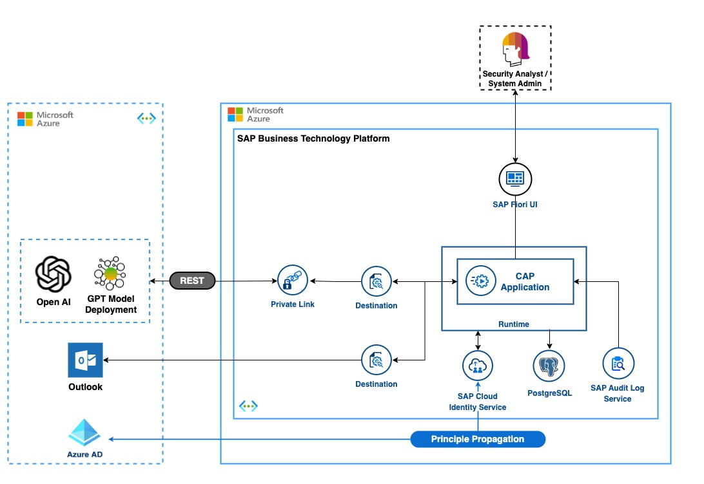

# Secure analysis of BTP Audit Logs using Microsoft Azure OpenAI and Private Link

## Business Outcome

Help system admins and security analysts in presenting the logs in a readable and user-friendly format and provide them with timely and actionable insights to support maintain system integrity and security.

## Value Proposition

### Customer Challenges Addressed

Audit logs are crucial for identifying security-related activities within a system. However, these logs often contain unstructured data, making the process of reading and understanding them time-consuming and challenging

## Role of SAP BTP

- Improves developer/administrator efficiency on BTP
- Helps analyzing the Audit Logs of the BTP using the capabilities of Azure OpenAI and SAP PrivateLink, to securely transfer and analyze the data. With help of LLM we can transform the raw, unstructured logs into a format that allows for quick identification of critical system activities, particularly those relevant to security.
- Potential product capability for BTP Audit Log
- Large Language Model-based summarization helps to efficiently summarize audit logs into human-readable texts that are easy to process

## Getting Started

Configure Azure OpenAI with SAP Private Link using the [SAP docs](https://help.sap.com/docs/private-link/private-link1/azure-openai).

- Run `npm install` from root
- Start Docker demon and execute `docker compose up` from root
- Run `cds deploy`
- Verify db setup from [PSQL Admin portal](http://localhost:8080/?pgsql=db&username=postgres&db=auditlog&ns=public)
- Create your `.env` file from the [env.template](./test/env.template), put it in root and maintain your Azure OpenAI API key and endpoint
- Open a new terminal and run `cds watch` (in VS Code simply choose _**Terminal** > Run Task > cds watch_)
- Execute REST calls [http://localhost:4004/odata/v4/audit/AuditLogs](./test/audit.http) to create a new audit entries

Navigate to the Fiori app for the full demo experience.

## Next Steps

- Learn about [large document summarization strategies](https://github.com/microsoft/azure-openai-design-patterns/blob/main/patterns/01-large-document-summarization/README.md) (map reduce vs. refine) and how to apply them to your use case.
- Find code samples using langchain.js [here](https://js.langchain.com/docs/modules/chains/popular/summarize)
